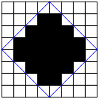
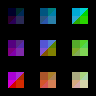
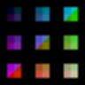

[](https://classroom.github.com/open-in-codespaces?assignment_repo_id=14036161)
# Midterm Project - Performance

> This performance assignment is based on the one by Bryant and O’Hallaron for *Computer Systems: A Programmer’s Perspective, Third Edition*.  Which was further modified by Matthew Flatt at University of Utah (https://my.eng.utah.edu/~cs4400/performance.html)

This assignment deals with optimizing memory intensive code, and the area of image processing offers many examples of functions that can benefit from optimization. In this lab, we will consider two image processing operations: `pinwheel`, which rotates a diamond-shaped portion of an image counter-clockwise by 90 degrees while also converting to grayscale, and `glow`, which blurs an image to simulate glowing colors in a fog.

*These instructions are long, but the lab itself may not be too time-consuming to get the threshold results required for full credit. The potential upside for clever optimizations is anyone’s guess.*

## Prepare Your Environment

Your overall goal for this lab will to be make the program perform better (i.e., optimize the code). This means, to compare the relative performance of each student's work, that we will need to be running on the same types of machines.  Since students have all different types of computers, you will once again need to work within a GitHub CodeSpace.  This
allows us to ensure that you will be using an x86-64 Linux environment and equally spec'ed equipment.

1. Click this link and Accept the Project to clone your own copy of the
   repository: [Midterm Project - Performance](https://classroom.github.com/a/jJr25jgn).
2. Once the repository has been created, refresh the page and click the "Open
   in GitHub Codespaces" button.

You will now be within a Visual Studio code environment that is contained
within your web browser.  It has a terminal, and a full Linux environment.

You can return to the same Codespace at any time by visiting [https://github.com/codespaces](https://github.com/codespaces) and selecting the Codespace.

There will be a number of files in the repo. **The only file you will be modifying is `"kernels.c"`.** The `"driver.c"` program is a driver program that allows you to evaluate the performance of your solutions. Use the command `make driver` to generate the driver code and run it with the command `./driver`.

## Image Representation

For this lab, we will consider an image to be represented as a size followed by a two-dimensional matrix $M$, where $M_{i,j}$ denotes the value of $(i,j)$th pixel of $M$. Pixel values are triples of red, green, and blue (RGB) values. We will only consider square images. Let N denote the number of rows (or columns) of an image. Rows and columns are numbered, in C-style, from $0$ to $N-1$.

## Pinwheel Operation

Given this representation, the `pinwheel` operation applies to a diamond-shaped center portion of the image. The diamond center is defined as all the pixels that are completely bounded by lines drawn from the center of one of the image to the center of an adjacent edge. For example, in an image of size 8, the diamond pixels are the ones filled in the following image:



To determine whether a pixel indexed as $(i,j)$ is in the diamond for an image of size $N$, add $1/2$ to each component to conceptually move to the center of the pixel, subtract $N/2$ from each component to effectively find the distance to the image’s midpoint, then check whether the absolute values of the adjusted components sum to less than $N/2$:

$$abs(i+1/2-N/2) + abs(j+1/2-N/2) < N/2$$

Within the diamond portion, the following transformation applies (using the original, unadjusted index components):

- *Transpose*: For each $(i,j)$ pair, $M_{i,j}$ and $M_{j,i}$ are interchanged.

- *Exchange rows*: Row i is exchanged with row $N-1-i$. Exchanging rows after transposing has the effect of rotating an image by 90 degrees.

- *Grayscale*: Set the red, green, and blue components all to the average of the three components.

For example, applying pinwheel to


produces


## Glow Operation

The `glow` operation is implemented by replacing every pixel value with a combination of nine pixels: the pixels that form a 3x3 block with the target pixel in the center. Pixels in the source image are weighted as follows:

$$\begin{matrix}
0.16 & 0.00 & 0.16\\
0.00 & 0.30 & 0.00\\
0.16 & 0.00 & 0.16
\end{matrix}$$

That is, the new value of $M_{i,j}$ is computed as

$$M_{i-1,j-1} \times 0.16 + M_{i+1,j-1} \times 0.16 + M_{i,j} \times 0.30 + M_{i-1,j+1} \times 0.16 + M_{i+1,j+1} \times 0.16$$

For the purposes of computing $M_{i,j}$’s value, neighbor pixels beyond the edge of the image are treated as black.

For example, applying glow to



produces



## Data Structures

The core data structure deals with image representation. A pixel is a struct as shown below:

```C
typedef union {
  struct {
    unsigned short red;   /* R value */
    unsigned short green; /* G value */
    unsigned short blue;  /* B value */
  };
  int dim;
} pixel;
```

An image `I` is represented as a one-dimensional array of `pixels`. The first “pixel” in an image uses `dim` to report the dimension of the image (i.e., the height and width, which are the same). Each subsequent pixel uses the `red`, `green`, and `blue` fields for one pixel’s 16-bit RGB values. The $(i,j)$th pixel of an image `I` is `I[RIDX(i,j,I->dim)]`, where `RIDX` is a macro defined as follows:

```C
#define RIDX(i,j,n) (1+(i)*(n)+(j))
```

See the file `"defs.h"` for this code.

The pinwheel and glow functions receive two `pixel*` pointers representing source and destination images. The source image must not be changed, and the destination image must be filled with the result of transforming the source. The source and destination images have the same dimensions, and the destination dimension is already filled in when `pinwheel` or `rotate` is called.

## Pinwheel Implementation

The following C function computes the result of pinwheeling the source image `src` and stores the result in destination image `dest`. It implements the diamond-inclusion test plus all three transformations (transpose, exchange, and grayscale) in a single pass.

```C
void naive_pinwheel(pixel *src, pixel *dest)
{
  int i, j;

  for (i = 0; i < src->dim; i++)
    for (j = 0; j < src->dim; j++) {
      /* Check whether we're in the diamond region */
      if ((fabs(i + 0.5 - src->dim/2) + fabs(j + 0.5 - src->dim/2)) < src->dim/2) {
        /* In diamond region, so rotate and grayscale */
        int s_idx = RIDX(i, j, src->dim);
        int d_idx = RIDX(src->dim - j - 1, i, src->dim);
        dest[d_idx].red = ((int)src[s_idx].red
                            + src[s_idx].green
                            + src[s_idx].blue) / 3;
        dest[d_idx].green = ((int)src[s_idx].red
                              + src[s_idx].green
                              + src[s_idx].blue) / 3;
        dest[d_idx].blue = ((int)src[s_idx].red
                            + src[s_idx].green
                            + src[s_idx].blue) / 3;
      } else {
        /* Not in diamond region, so keep the same */
        int s_idx = RIDX(i, j, src->dim);
        int d_idx = RIDX(i, j, src->dim);
        dest[d_idx] = src[s_idx];
      }
    }
}
```

The above code scans the rows of the source image matrix, copying to the columns of the destination image matrix. Your task is to rewrite this code to make it run as fast as possible using techniques like code motion and loop reorganizations.

See the file `"kernels.c"` for this code.

## Glow Implementation

The `glow` function takes as input a source image `src` and returns the blurred result in the destination image `dst`. Here is part of an implementation:

```C
void naive_glow(pixel *src, pixel *dst)
{
  int i, j;

  for (i = 0; i < src->dim; i++)
    for (j = 0; j < src->dim; j++)
      dst[RIDX(i, j, src->dim)] = weighted_combo(src->dim, i, j, src);
}
```

The function `weighted_combo` performs the weighted combination of the pixels around the $(i,j)$th pixel. Your task is to optimize `glow` (and `weighted_combo`) to run as fast as possible. (Note: The function `weighted_combo` is a local function and you can change it or get rid of it altogether to implement `glow` in some other way.)

This code and an implementation of `weighted_combo` are in the file` "kernels.c"`.

## Performance Measures

Our main performance measure is *CPE* or *Cycles per Element*. If a function takes C cycles to run for an image of size $N \times N$, the CPE value is $C/N^2$. When you build and run *driver* its output shows CPE results for 5 different values of $N$. The baseline measurements were made on a default Github Codespace instance.

The ratios (speedups) of the optimized implementation over the naive one will constitute a *score* of your implementation. To summarize the overall effect over different values of $N$, we will compute the geometric mean of the results for these 5 values. See Evaluation for more information on grading.

## Assumptions

To make life easier, you can assume that $N$ is a multiple of 32. Your code must run correctly for all such values of $N$ but we will measure its performance only for the 5 values reported by `driver`.

## Infrastructure

We have provided support code to help you test the correctness of your implementations and measure their performance. This section describes how to use this infrastructure. The exact details of each part of the assignment are described in the following section.

*Note: The only source file you will be modifying is `"kernels.c"`.*

### Versioning

You will be writing many versions of the `pinwheel` and `glow` routines. To help you compare the performance of all the different versions you’ve written, we provide a way of “registering” functions.

For example, the file `"kernels.c" `that we have provided you contains the following function:

```C
void register_pinwheel_functions() {
  add_pinwheel_function(&pinwheel, pinwheel_descr);
}
```

This function contains one or more calls to `add_pinwheel_function`. In the above example, `add_pinwheel_function` registers the function `pinwheel` along with a string `pinwheel_descr` which is an ASCII description of what the function does. See the file `"kernels.c"` to see how to create the string descriptions. This string can be at most 256 characters long.

A similar function for your `glow` kernels is provided in the file `kernel.c`.

### Driver

The source code you will write will be linked with object code that we supply into a `driver` binary. To create this binary, you will need to execute the command

```bash
$ make driver
```

You will need to re-make `driver` each time you change the code in `"kernels.c"`.

To test your implementations, you can then run the command:

```bash
$ ./driver
```

The `driver` can be run in four different modes:

- *Default mode*, in which all versions of your implementation are run.

- *Autograder mode*, in which only the `pinwheel` and `glow` functions are run. This is the mode we will run in when we use the driver to grade your handin.

- *File mode*, in which only versions that are mentioned in an input file are run.

- *Dump mode*, in which a one-line description of each version is dumped to a text file. You can then edit this text file to keep only those versions that you’d like to test using the *file mode*. You can specify whether to quit after dumping the file or if your implementations are to be run.

If run without any arguments, `driver` will run all of your versions (*default mode*). Other modes and options can be specified by command-line arguments to `driver`, as listed below:

- `-g` — Run only pinwheel and glow functions (*autograder* mode).

- `-f ‹funcfile›` — Execute only those versions specified in `‹funcfile›` (*file mode*).

- `-d ‹dumpfile›` —- Dump the names of all versions to a dump file called `‹dumpfile›`, one line to a version (*dump mode*).

- `-q` — Quit after dumping version names to a dump file. To be used in tandem with `-d`. For example, to quit immediately after printing the dump file, type `./driver -qd dumpfile`.

- `-i` — Write the main test images to files that end in `".image"`. Each file contains $N$ twice to indicate the height and width of the image, and it contains the pixel values as a sequence of red, green, and blue numbers. Combined with `-m pinwheel` or -`m glow`, these dumps can be helpful in debugging problems with your functions.

- `-I` — Write all the benchmarks images to files that end in `".image"`.

- `-m ‹mode›` — Selects the starting image, where `‹mode›` can be `random`, `pinwheel`, or `glow`. The default (and grading mode) is `random`.

- `-h` — Print the command line usage.

## Optimizing Pinwheel (50 points)

In this part, you will optimize pinwheel to achieve as low a CPE as possible. You should compile `driver` and then run it with the appropriate arguments to test your implementations.

For example, running `driver` with the supplied naive version (for `pinwheel`) generates the output shown below:

```bash
$ ./driver
Pinwheel: Version = naive_pinwheel: baseline implementation:
Dim 64 128 256 512 1024 Mean
Your CPEs 7.2 7.1 6.8 8.4 8.8
Baseline CPEs 7.2 7.1 6.8 8.4 8.8
Speedup 1.0 1.0 1.0 1.0 1.0 1.0
```

## Optimizing Glow (50 points)

In this part, you will optimize `glow` to achieve as low a CPE as possible.

For example, running driver with the supplied naive version (for `glow`) generates the output shown below:

```bash
$ ./driver
Glow: Version = naive_glow: baseline implementation:
Dim 32 64 128 256 512 Mean
Your CPEs 97.9 99.9 100.9 101.6 102.0
Baseline CPEs 97.9 99.9 100.9 101.6 102.0
Speedup 1.0 1.0 1.0 1.0 1.0 1.0
```

## Coding Rules

You may write any code you want, as long as it satisfies the following:

- It must be in ANSI C with GNU extensions. You may not use any embedded assembly language statements or special `gcc` directives (don't modify the `make` file).

- It must not interfere with the time measurement mechanism. You may also be penalized if your code prints any extraneous information.

You can only modify code in `"kernels.c"`. You are allowed to define macros, additional global variables, and other procedures in that file.

## Evaluation

Your solutions for `pinwheel` and `glow` will each count for 50% of your grade. The score for each will be based on the following:

- Correctness: You will get NO CREDIT for buggy code that causes the driver to complain! This includes code that correctly operates on the test sizes, but incorrectly on image matrices of other sizes. As mentioned earlier, you may assume that the image dimension is a multiple of 32.

- CPE: You will get full credit for your implementations of pinwheel and glow if they are correct and achieve mean CPEs improvements at or above thresholds 2.5 and 4.0, respectively. In more detail:
  - `pinwheel`
    - between 1.0–2.5 mean speedup: linear mapping to 0–50 points
    - above 2.5 mean speedup: 50 points
  - `glow`
    - between 1.0–4.0 mean speedup: linear mapping to 0–50 points
    - above 4.0 mean speedup: 50 points

## Submission

Your work must be submitted to Anchor for degree credit and to Gradescope for
grading.

1. Ensure that you `commit` and `push` your local code changes to your remote
   repository.
2. Upload your submission to [Gradescope](https://www.gradescope.com) via the
   appropriate submission link by selecting the correct GitHub repository from
   the drop-down list.
3. Export a zip archive of your GitHub repository by visiting your repo on
   [GitHub](https://www.github.com), clicking on the green `Code` button, and
   selecting "Download Zip".
4. Upload the zip file of your repository to Anchor using the form below.